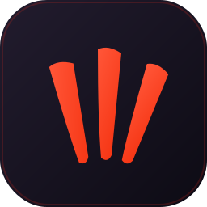

<p align="center">
  
</p>

<h1 align="center">PHPClaw for Laravel</h1>

[](https://packagist.org/packages/kevariable/phpclaw-laravel)
[](https://github.com/kevariable/phpclaw-laravel/actions/workflows/run-tests.yml)
[](https://github.com/kevariable/phpclaw-laravel/actions/workflows/phpstan.yml)

A role-routed, tool-using AI agent platform for Laravel — **model-agnostic**. The core depends on a small `LlmDriver` port, so it works with any LLM: the [Laravel AI SDK](https://github.com/laravel/ai) (OpenAI, Anthropic, Gemini, Bedrock, …), [Prism](https://github.com/prism-php/prism), or your own driver. Inspired by [PHPClaw](https://github.com/vilanobeachflorida/phpclaw), rebuilt the Laravel way: SOLID, CQRS, and a driver port so the whole agent layer is testable without ever calling a model.

Full docs in [docs/](docs/): [architecture](docs/architecture.md) · [routing](docs/routing.md) · [tools](docs/tools.md) · [modules](docs/modules.md) · [sessions](docs/sessions.md) · [memory](docs/memory.md) · [tasks](docs/tasks.md) · [REST API](docs/api.md) · [commands](docs/commands.md) · [browser control](docs/browser.md) · [development](docs/development.md).

## What it gives you

- **Role-based model routing with fallback** — a role maps to a primary model and an ordered fallback chain; the runner fails over when a model errors or rate-limits.
- **Tools** — 14 shipped (calculator, http, filesystem-read, grep, system/project/code analysis, memory) handed to the model via the Laravel AI SDK's function-calling. Add your own by implementing one interface.
- **Modules / tool-router** — per-task tool whitelists (`reasoning`, `coding`, `research`, …) bundling a role + the tools that task may use.
- **Sessions** — persisted chat transcripts that carry context across turns.
- **Memory** — long-term notes the agent can write and recall, with compaction.
- **Queued tasks** — run the agent in the background on Laravel's queue.
- **REST API** — a token-guarded `POST /phpclaw/chat` endpoint.
- **Browser control** — a bundled (TypeScript) Chrome extension lets the agent drive a real browser.
- **Dangerous tools, guarded** — `shell_exec` / `file_write` / `delete_file` ship behind a static prohibition guard (like `DB::prohibitDestructiveCommands()`).
- **CQRS bus** — every action is a `Command`/`Query` dispatched to a dedicated handler.
- **A driver port (`LlmDriver`)** — the core depends on an interface; `laravel/ai` is one (optional) driver, so the whole stack is unit-tested with a fake driver.

## Installation

```bash
composer require kevariable/phpclaw-laravel
php artisan vendor:publish --tag="phpclaw-laravel-config"
```

### Pick an LLM provider

Roles point at a `provider` + `model`, driven by env (defaults shown):

```dotenv
PHPCLAW_PROVIDER=gemini             # any provider your driver supports (openai, anthropic, gemini, ollama, …)
PHPCLAW_MODEL=gemini-2.5-flash
PHPCLAW_FAST_MODEL=gemini-2.5-flash-lite
PHPCLAW_PRO_MODEL=gemini-2.5-pro

PHPCLAW_API_TOKEN=a-long-random-string      # for the REST API
PHPCLAW_BROWSER_TOKEN=a-long-random-string  # for the browser extension
```

Then choose how the package talks to that provider — it ships with the `LlmDriver` port and three ways to fill it:

1. **Laravel AI SDK** (default driver) — `composer require laravel/ai` (Laravel 12.62+ / 13), configure its provider. Supports OpenAI, Anthropic, Gemini, Bedrock, and more.
2. **Prism** — if your app already uses [Prism](https://github.com/prism-php/prism), bind a tiny Prism driver (see [docs/drivers.md](docs/drivers.md)).
3. **Your own** — implement `Kevariable\PhpclawLaravel\Contracts\LlmDriver` and bind it.

```php
// Bring your own driver:
$this->app->singleton(\Kevariable\PhpclawLaravel\Contracts\LlmDriver::class, MyDriver::class);
```

## Usage

```php
use Kevariable\PhpclawLaravel\Facades\Phpclaw;
use Kevariable\PhpclawLaravel\Tools\CalculatorTool;

// Run by role
$result = Phpclaw::run('reasoning', 'What is 19 * 23?', tools: [new CalculatorTool]);
echo $result->text;    // model output
echo $result->model;   // the model that actually answered (after any fallback)

// Run by module (uses the module's role + its tool whitelist)
Phpclaw::runModule('coding', 'Find where the bus is bound and explain it.');

// Inspect configuration
Phpclaw::roles();      // list<RoleDefinition>
Phpclaw::tools();      // list<Tool>
Phpclaw::modules();    // list<ModuleDefinition>
```

### Roles & modules

`config/phpclaw.php`:

```php
'roles' => [
    'reasoning' => [
        'provider' => 'gemini',
        'model' => 'gemini-2.5-flash',
        'timeout' => 120,
        'fallback' => [['provider' => 'gemini', 'model' => 'gemini-2.5-flash-lite']],
    ],
],

'modules' => [
    'coding' => ['role' => 'coding', 'tools' => ['file_read', 'dir_list', 'grep_search', 'code_symbols']],
],
```

### Custom tools

Implement `Kevariable\PhpclawLaravel\Contracts\Tool` and add the class to `phpclaw.tools` (or scaffold one with `php artisan make:phpclaw-tool WeatherTool`):

```php
class WeatherTool implements Tool
{
    public function name(): string { return 'weather'; }
    public function description(): string { return 'Get the weather for a city.'; }
    public function parameters(): array
    {
        return ['city' => ['type' => 'string', 'description' => 'City name.', 'required' => true]];
    }
    public function run(array $arguments): string { return "Sunny in {$arguments['city']}."; }
}
```

### Dangerous tools

`shell_exec`, `file_write`, `file_append`, `delete_file`, `mkdir`, `move_file`, and `db_query` are shipped but **prohibited by default** — every call is gated like Laravel's `DB::prohibitDestructiveCommands()`. Opt in when you trust the environment:

```php
use Kevariable\PhpclawLaravel\DangerousTools;

DangerousTools::allow();      // enable (off by default) — any dangerous tool works
DangerousTools::prohibit();   // re-lock; calls throw DangerousToolsProhibitedException

// or via the facade:
Phpclaw::prohibitDangerousTools();
```

### Sessions, memory & queued tasks

```php
Phpclaw::run('reasoning', 'long job…');   // synchronous

// Background (queued) — see docs/tasks.md
php artisan phpclaw:run reasoning "long job…" --queue
```

## Artisan commands

| Command | Purpose |
|---|---|
| `phpclaw:run {role} {prompt}` | One-shot generation (`--queue` to background it) |
| `phpclaw:chat` | Interactive REPL (`--role`, `--module`, `--session`) |
| `phpclaw:roles` / `:providers` / `:models` | Inspect roles, providers, models |
| `phpclaw:tools` / `:tools:test` | List / smoke-test tools |
| `phpclaw:modules` | List modules |
| `phpclaw:status` | Config summary |
| `phpclaw:sessions` / `:session:show {id}` | Chat sessions |
| `phpclaw:memory:show` / `:memory:compact` | Long-term memory |
| `phpclaw:tasks` / `:task:show {id}` | Queued tasks |
| `make:phpclaw-tool {name}` | Generate a tool stub |

See [docs/commands.md](docs/commands.md) for the full reference.

## REST API

```bash
curl -X POST http://localhost:8000/phpclaw/chat \
  -H "Authorization: Bearer $PHPCLAW_API_TOKEN" \
  -H "Content-Type: application/json" \
  -d '{"prompt":"Explain CQRS in one sentence.","module":"reasoning"}'
# => {"response":"…","model":"gemini-2.5-flash"}
```

See [docs/api.md](docs/api.md).

## Browser control

A bundled TypeScript Chrome extension lets the agent drive a real browser. Publish the built extension, load it unpacked, and add the `BrowserControlTool`:

```bash
php artisan vendor:publish --tag="phpclaw-extension"   # -> base_path('phpclaw-extension')
```

See [docs/browser.md](docs/browser.md) for the full setup and the extension's TypeScript build.

## Testing

Targets PHP 8.4 (Laravel 13 pulls Symfony 8, which needs PHP >= 8.4.1). The bundled Docker image pins it:

```bash
make build      # build the PHP 8.4 image
make test       # Pest suite
make coverage   # coverage (100%)
make analyse    # PHPStan (level 5 + Larastan)
make format     # Pint
```

Natively, with PHP 8.4: `composer test` / `composer analyse` / `composer format`. See [docs/development.md](docs/development.md).

## License

The MIT License (MIT). See [License File](LICENSE.md).
